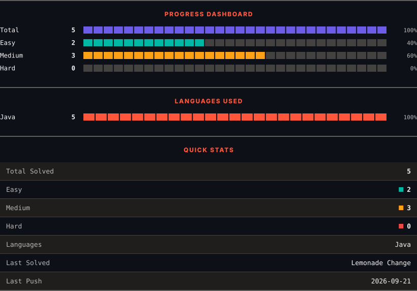
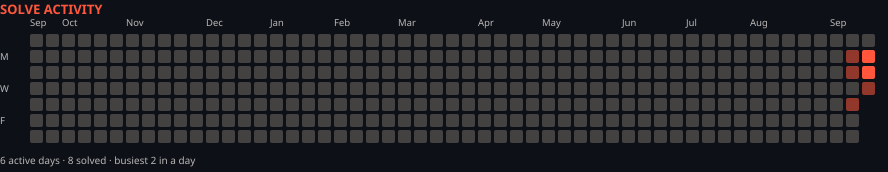

<h1>LeetCode Solutions</h1>

<em>Automatically synced with every accepted submission</em>

   

<picture>
  <source media="(prefers-color-scheme: dark)" srcset=".leetsync/stats-dark.svg">
  <source media="(prefers-color-scheme: light)" srcset=".leetsync/stats-light.svg">
  
</picture>

<picture>
  <source media="(prefers-color-scheme: dark)" srcset=".leetsync/calendar-dark.svg">
  <source media="(prefers-color-scheme: light)" srcset=".leetsync/calendar-light.svg">
  
</picture>

---

### ALL SOLUTIONS

| # | Problem | Difficulty | Language | Date |
|:---:|:--------|:----------:|:--------:|:----:|
| 39 | [Combination Sum](problems/0039-Combination-Sum) | 🟧 Medium | `Java` | 2026-09-21 |
| 40 | [Combination Sum II](problems/0040-Combination-Sum-II) | 🟧 Medium | `Java` | 2026-09-21 |
| 122 | [Best Time to Buy and Sell Stock II](problems/0122-Best-Time-to-Buy-and-Sell-Stock-II) | 🟧 Medium | `Java` | 2026-09-15 |
| 509 | [Fibonacci Number](problems/0509-Fibonacci-Number) | 🟩 Easy | `Java` | 2026-09-14 |
| 860 | [Lemonade Change](problems/0860-Lemonade-Change) | 🟩 Easy | `Java` | 2026-09-17 |

---

Auto-synced by <strong>LeetSync</strong> · Built by <a href="https://deveshsamant.in/">Devesh Samant</a>

