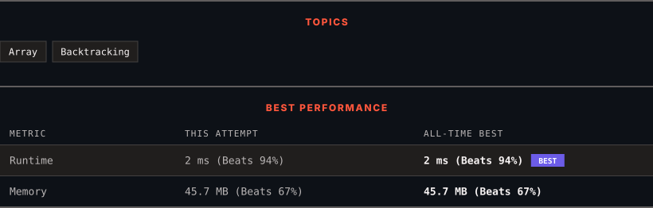

<div align="center">

# 39. Combination Sum

      

[](https://leetcode.com/problems/combination-sum/)

</div>

---

<div align="center">

<picture>
  <source media="(prefers-color-scheme: dark)" srcset="panel-dark.svg">
  <source media="(prefers-color-scheme: light)" srcset="panel-light.svg">
  
</picture>

</div>

> **New personal best** — Runtime improved on this submission.

### HOW IT WENT

| | |
|:--|:--|
| **Attempts** | first try |
| **Time to solve** | 15 min |
| **Verdicts** | ✅ Accepted |

---

### NOTES

_No notes yet._

---

### SOLUTIONS (1)

| # | File | Language | Date |
|:-:|------|:--------:|:----:|
| 1 | [sol1.java](./sol1.java) | `Java` | 2026-09-21 ← **latest** |

---

### PROBLEM DESCRIPTION

Given an array of **distinct** integers `candidates` and a target integer `target`, return *a list of all **unique combinations** of *`candidates`* where the chosen numbers sum to *`target`*.* You may return the combinations in **any order**.

The **same** number may be chosen from `candidates` an **unlimited number of times**. Two combinations are unique if the frequency of at least one of the chosen numbers is different.

The test cases are generated such that the number of unique combinations that sum up to `target` is less than `150` combinations for the given input.

 

**Example 1:**

```

**Input:** candidates = [2,3,6,7], target = 7
**Output:** [[2,2,3],[7]]
**Explanation:**
2 and 3 are candidates, and 2 + 2 + 3 = 7. Note that 2 can be used multiple times.
7 is a candidate, and 7 = 7.
These are the only two combinations.

```

**Example 2:**

```

**Input:** candidates = [2,3,5], target = 8
**Output:** [[2,2,2,2],[2,3,3],[3,5]]

```

**Example 3:**

```

**Input:** candidates = [2], target = 1
**Output:** []

```

 

**Constraints:**

	- `1 <= candidates.length <= 30`

	- `2 <= candidates[i] <= 40`

	- All elements of `candidates` are **distinct**.

	- `1 <= target <= 40`

---

<div align="center">

<sub>Auto-synced by <strong>LeetSync</strong> · Built by <a href="https://deveshsamant.in/">Devesh Samant</a></sub>

</div>
