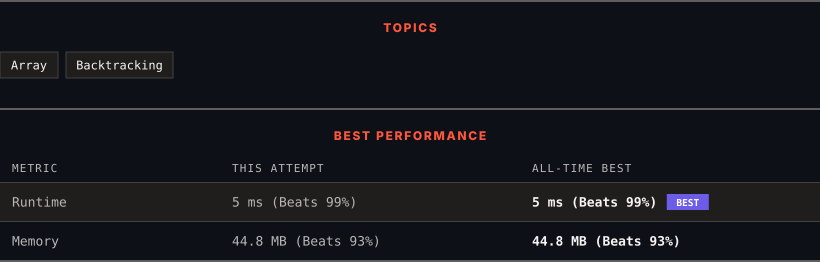

<div align="center">

# 40. Combination Sum II

      

[](https://leetcode.com/problems/combination-sum-ii/)

</div>

---

<div align="center">

<picture>
  <source media="(prefers-color-scheme: dark)" srcset="panel-dark.svg">
  <source media="(prefers-color-scheme: light)" srcset="panel-light.svg">
  
</picture>

</div>

> **New personal best** — Runtime improved on this submission.

### HOW IT WENT

| | |
|:--|:--|
| **Attempts** | first try |
| **Time to solve** | under a minute |
| **Verdicts** | ✅ Accepted |

---

### NOTES

_No notes yet._

---

### SOLUTIONS (1)

| # | File | Language | Date |
|:-:|------|:--------:|:----:|
| 1 | [sol1.java](./sol1.java) | `Java` | 2026-09-21 ← **latest** |

---

### PROBLEM DESCRIPTION

Given a collection of candidate numbers (`candidates`) and a target number (`target`), find all unique combinations in `candidates` where the candidate numbers sum to `target`.

Each number in `candidates` may only be used **once** in the combination.

**Note:** The solution set must not contain duplicate combinations.

 

**Example 1:**

```

**Input:** candidates = [10,1,2,7,6,1,5], target = 8
**Output:** 
[
[1,1,6],
[1,2,5],
[1,7],
[2,6]
]

```

**Example 2:**

```

**Input:** candidates = [2,5,2,1,2], target = 5
**Output:** 
[
[1,2,2],
[5]
]

```

 

**Constraints:**

	- `1 <= candidates.length <= 100`

	- `1 <= candidates[i] <= 50`

	- `1 <= target <= 30`

---

<div align="center">

<sub>Auto-synced by <strong>LeetSync</strong> · Built by <a href="https://deveshsamant.in/">Devesh Samant</a></sub>

</div>
