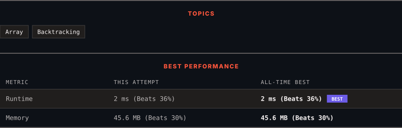

<div align="center">

# 46. Permutations

      

[](https://leetcode.com/problems/permutations/)

</div>

---

<div align="center">

<picture>
  <source media="(prefers-color-scheme: dark)" srcset="panel-dark.svg">
  <source media="(prefers-color-scheme: light)" srcset="panel-light.svg">
  
</picture>

</div>

### HOW IT WENT

| | |
|:--|:--|
| **Attempts** | 2 before accepted |
| **Time to solve** | 11 min |
| **Verdicts** | ✅ Accepted → ✅ Accepted |

---

### NOTES

_No notes yet._

---

### SOLUTIONS (2)

| # | File | Language | Date |
|:-:|------|:--------:|:----:|
| 1 | [sol1.java](./sol1.java) | `Java` | 2026-09-22 |
| 2 | [sol2.java](./sol2.java) | `Java` | 2026-09-22 ← **latest** |

---

### PROBLEM DESCRIPTION

Given an array `nums` of distinct integers, return all the possible permutations. You can return the answer in **any order**.

 

**Example 1:**

```
**Input:** nums = [1,2,3]
**Output:** [[1,2,3],[1,3,2],[2,1,3],[2,3,1],[3,1,2],[3,2,1]]

```

**Example 2:**

```
**Input:** nums = [0,1]
**Output:** [[0,1],[1,0]]

```

**Example 3:**

```
**Input:** nums = [1]
**Output:** [[1]]

```

 

**Constraints:**

	- `1 <= nums.length <= 6`

	- `-10 <= nums[i] <= 10`

	- All the integers of `nums` are **unique**.

---

<div align="center">

<sub>Auto-synced by <strong>LeetSync</strong> · Built by <a href="https://deveshsamant.in/">Devesh Samant</a></sub>

</div>
