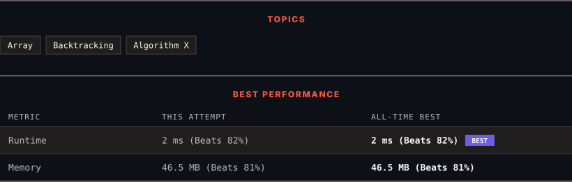

<div align="center">

# 51. N-Queens

      

[](https://leetcode.com/problems/n-queens/)

</div>

---

<div align="center">

<picture>
  <source media="(prefers-color-scheme: dark)" srcset="panel-dark.svg">
  <source media="(prefers-color-scheme: light)" srcset="panel-light.svg">
  
</picture>

</div>

> **New personal best** — Runtime improved on this submission.

### HOW IT WENT

| | |
|:--|:--|
| **Attempts** | first try |
| **Time to solve** | 1 h 18 min |
| **Verdicts** | ✅ Accepted |

---

### NOTES

_No notes yet._

---

### SOLUTIONS (1)

| # | File | Language | Date |
|:-:|------|:--------:|:----:|
| 1 | [sol1.java](./sol1.java) | `Java` | 2026-10-06 ← **latest** |

---

### PROBLEM DESCRIPTION

The **n-queens** puzzle is the problem of placing `n` queens on an `n x n` chessboard such that no two queens attack each other.

Given an integer `n`, return *all distinct solutions to the **n-queens puzzle***. You may return the answer in **any order**.

Each solution contains a distinct board configuration of the n-queens' placement, where `'Q'` and `'.'` both indicate a queen and an empty space, respectively.

 

**Example 1:**


```

**Input:** n = 4
**Output:** [[".Q..","...Q","Q...","..Q."],["..Q.","Q...","...Q",".Q.."]]
**Explanation:** There exist two distinct solutions to the 4-queens puzzle as shown above

```

**Example 2:**

```

**Input:** n = 1
**Output:** [["Q"]]

```

 

**Constraints:**

	- `1 <= n <= 9`

---

<div align="center">

<sub>Auto-synced by <strong>LeetSync</strong> · Built by <a href="https://deveshsamant.in/">Devesh Samant</a></sub>

</div>
