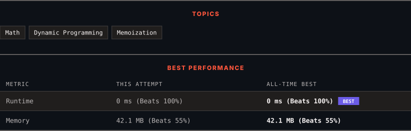

<div align="center">

# 70. Climbing Stairs

      

[](https://leetcode.com/problems/climbing-stairs/)

</div>

---

<div align="center">

<picture>
  <source media="(prefers-color-scheme: dark)" srcset="panel-dark.svg">
  <source media="(prefers-color-scheme: light)" srcset="panel-light.svg">
  
</picture>

</div>

> **New personal best** — Runtime improved on this submission.

### HOW IT WENT

| | |
|:--|:--|
| **Attempts** | first try |
| **Time to solve** | under a minute |
| **Verdicts** | ✅ Accepted |

---

### NOTES

_No notes yet._

---

### SOLUTIONS (1)

| # | File | Language | Date |
|:-:|------|:--------:|:----:|
| 1 | [sol1.java](./sol1.java) | `Java` | 2026-10-08 ← **latest** |

---

### PROBLEM DESCRIPTION

You are climbing a staircase. It takes `n` steps to reach the top.

Each time you can either climb `1` or `2` steps. In how many distinct ways can you climb to the top?

 

**Example 1:**

```

**Input:** n = 2
**Output:** 2
**Explanation:** There are two ways to climb to the top.
1. 1 step + 1 step
2. 2 steps

```

**Example 2:**

```

**Input:** n = 3
**Output:** 3
**Explanation:** There are three ways to climb to the top.
1. 1 step + 1 step + 1 step
2. 1 step + 2 steps
3. 2 steps + 1 step

```

 

**Constraints:**

	- `1 <= n <= 45`

---

<div align="center">

<sub>Auto-synced by <strong>LeetSync</strong> · Built by <a href="https://deveshsamant.in/">Devesh Samant</a></sub>

</div>
