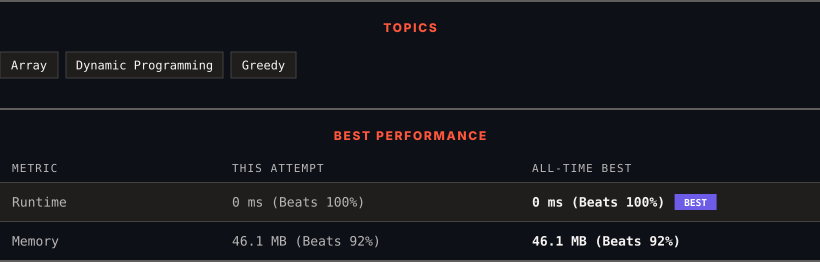

<div align="center">

# 122. Best Time to Buy and Sell Stock II

      

[](https://leetcode.com/problems/best-time-to-buy-and-sell-stock-ii/)

</div>

---

<div align="center">

<picture>
  <source media="(prefers-color-scheme: dark)" srcset="panel-dark.svg">
  <source media="(prefers-color-scheme: light)" srcset="panel-light.svg">
  
</picture>

</div>

> **New personal best** — Runtime improved on this submission.

### HOW IT WENT

| | |
|:--|:--|
| **Attempts** | first try |
| **Time to solve** | 2 min |
| **Verdicts** | ✅ Accepted |

---

### NOTES

_No notes yet._

---

### SOLUTIONS (1)

| # | File | Language | Date |
|:-:|------|:--------:|:----:|
| 1 | [sol1.java](./sol1.java) | `Java` | 2026-09-15 ← **latest** |

---

### PROBLEM DESCRIPTION

You are given an integer array `prices` where `prices[i]` is the price of a given stock on the `i^th` day.

On each day, you may decide to buy and/or sell the stock. You can only hold **at most one** share of the stock at any time. However, you can sell and buy the stock multiple times on the **same day**, ensuring you never hold more than one share of the stock.

Find and return *the **maximum** profit you can achieve*.

 

**Example 1:**

```

**Input:** prices = [7,1,5,3,6,4]
**Output:** 7
**Explanation:** Buy on day 2 (price = 1) and sell on day 3 (price = 5), profit = 5-1 = 4.
Then buy on day 4 (price = 3) and sell on day 5 (price = 6), profit = 6-3 = 3.
Total profit is 4 + 3 = 7.

```

**Example 2:**

```

**Input:** prices = [1,2,3,4,5]
**Output:** 4
**Explanation:** Buy on day 1 (price = 1) and sell on day 5 (price = 5), profit = 5-1 = 4.
Total profit is 4.

```

**Example 3:**

```

**Input:** prices = [7,6,4,3,1]
**Output:** 0
**Explanation:** There is no way to make a positive profit, so we never buy the stock to achieve the maximum profit of 0.

```

 

**Constraints:**

	- `1 <= prices.length <= 3 * 10^4`

	- `0 <= prices[i] <= 10^4`

---

<div align="center">

<sub>Auto-synced by <strong>LeetSync</strong> · Built by <a href="https://deveshsamant.in/">Devesh Samant</a></sub>

</div>
