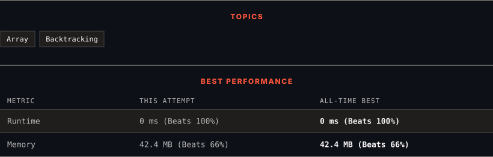

<div align="center">

# 216. Combination Sum III

      

[](https://leetcode.com/problems/combination-sum-iii/)

</div>

---

<div align="center">

<picture>
  <source media="(prefers-color-scheme: dark)" srcset="panel-dark.svg">
  <source media="(prefers-color-scheme: light)" srcset="panel-light.svg">
  
</picture>

</div>

### HOW IT WENT

| | |
|:--|:--|
| **Attempts** | 4 before accepted |
| **Time to solve** | 23 h 2 min |
| **Verdicts** | 🔧 Compile Error → ❌ Wrong Answer → ✅ Accepted → ✅ Accepted |

---

### NOTES

_No notes yet._

---

### SOLUTIONS (2)

| # | File | Language | Date |
|:-:|------|:--------:|:----:|
| 1 | [sol1.java](./sol1.java) | `Java` | 2026-09-22 |
| 2 | [sol2.java](./sol2.java) | `Java` | 2026-09-22 ← **latest** |

---

### PROBLEM DESCRIPTION

Find all valid combinations of `k` numbers that sum up to `n` such that the following conditions are true:

	- Only numbers `1` through `9` are used.

	- Each number is used **at most once**.

Return *a list of all possible valid combinations*. The list must not contain the same combination twice, and the combinations may be returned in any order.

 

**Example 1:**

```

**Input:** k = 3, n = 7
**Output:** [[1,2,4]]
**Explanation:**
1 + 2 + 4 = 7
There are no other valid combinations.
```

**Example 2:**

```

**Input:** k = 3, n = 9
**Output:** [[1,2,6],[1,3,5],[2,3,4]]
**Explanation:**
1 + 2 + 6 = 9
1 + 3 + 5 = 9
2 + 3 + 4 = 9
There are no other valid combinations.

```

**Example 3:**

```

**Input:** k = 4, n = 1
**Output:** []
**Explanation:** There are no valid combinations.
Using 4 different numbers in the range [1,9], the smallest sum we can get is 1+2+3+4 = 10 and since 10 > 1, there are no valid combination.

```

 

**Constraints:**

	- `2 <= k <= 9`

	- `1 <= n <= 60`

---

<div align="center">

<sub>Auto-synced by <strong>LeetSync</strong> · Built by <a href="https://deveshsamant.in/">Devesh Samant</a></sub>

</div>
