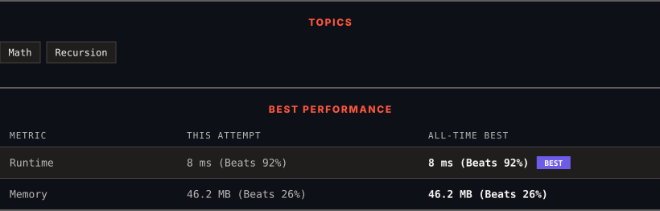

<div align="center">

# 326. Power of Three

      

[](https://leetcode.com/problems/power-of-three/)

</div>

---

<div align="center">

<picture>
  <source media="(prefers-color-scheme: dark)" srcset="panel-dark.svg">
  <source media="(prefers-color-scheme: light)" srcset="panel-light.svg">
  
</picture>

</div>

> **New personal best** — Runtime improved on this submission.

### HOW IT WENT

| | |
|:--|:--|
| **Attempts** | first try |
| **Time to solve** | under a minute |
| **Verdicts** | ✅ Accepted |

---

### NOTES

_No notes yet._

---

### SOLUTIONS (1)

| # | File | Language | Date |
|:-:|------|:--------:|:----:|
| 1 | [sol1.java](./sol1.java) | `Java` | 2026-09-25 ← **latest** |

---

### PROBLEM DESCRIPTION

Given an integer `n`, return *`true` if it is a power of three. Otherwise, return `false`*.

An integer `n` is a power of three, if there exists an integer `x` such that `n == 3^x`.

 

**Example 1:**

```

**Input:** n = 27
**Output:** true
**Explanation:** 27 = 3^3

```

**Example 2:**

```

**Input:** n = 0
**Output:** false
**Explanation:** There is no x where 3^x = 0.

```

**Example 3:**

```

**Input:** n = -1
**Output:** false
**Explanation:** There is no x where 3^x = (-1).

```

 

**Constraints:**

	- `-2^31 <= n <= 2^31 - 1`

 

**Follow up:** Could you solve it without loops/recursion?

---

<div align="center">

<sub>Auto-synced by <strong>LeetSync</strong> · Built by <a href="https://deveshsamant.in/">Devesh Samant</a></sub>

</div>
