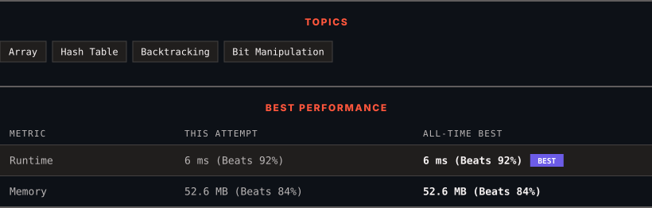

<div align="center">

# 491. Non-decreasing Subsequences

      

[](https://leetcode.com/problems/non-decreasing-subsequences/)

</div>

---

<div align="center">

<picture>
  <source media="(prefers-color-scheme: dark)" srcset="panel-dark.svg">
  <source media="(prefers-color-scheme: light)" srcset="panel-light.svg">
  
</picture>

</div>

> **New personal best** — Runtime improved on this submission.

### HOW IT WENT

| | |
|:--|:--|
| **Attempts** | first try |
| **Time to solve** | under a minute |
| **Verdicts** | ✅ Accepted |

---

### NOTES

_No notes yet._

---

### SOLUTIONS (1)

| # | File | Language | Date |
|:-:|------|:--------:|:----:|
| 1 | [sol1.java](./sol1.java) | `Java` | 2026-09-23 ← **latest** |

---

### PROBLEM DESCRIPTION

Given an integer array `nums`, return *all the different possible non-decreasing subsequences of the given array with at least two elements*. You may return the answer in **any order**.

 

**Example 1:**

```

**Input:** nums = [4,6,7,7]
**Output:** [[4,6],[4,6,7],[4,6,7,7],[4,7],[4,7,7],[6,7],[6,7,7],[7,7]]

```

**Example 2:**

```

**Input:** nums = [4,4,3,2,1]
**Output:** [[4,4]]

```

 

**Constraints:**

	- `1 <= nums.length <= 15`

	- `-100 <= nums[i] <= 100`

---

<div align="center">

<sub>Auto-synced by <strong>LeetSync</strong> · Built by <a href="https://deveshsamant.in/">Devesh Samant</a></sub>

</div>
