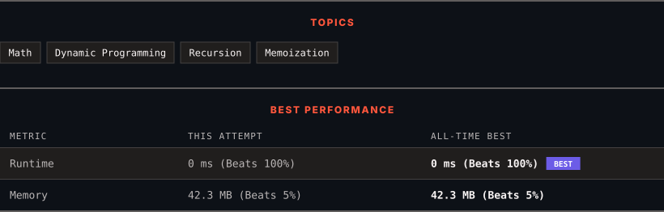

<div align="center">

# 509. Fibonacci Number

      

[](https://leetcode.com/problems/fibonacci-number/)

</div>

---

<div align="center">

<picture>
  <source media="(prefers-color-scheme: dark)" srcset="panel-dark.svg">
  <source media="(prefers-color-scheme: light)" srcset="panel-light.svg">
  
</picture>

</div>

> **New personal best** — Runtime improved on this submission.

### HOW IT WENT

| | |
|:--|:--|
| **Attempts** | first try |
| **Time to solve** | 8 min |
| **Verdicts** | ✅ Accepted |

---

### NOTES

_No notes yet._

---

### SOLUTIONS (1)

| # | File | Language | Date |
|:-:|------|:--------:|:----:|
| 1 | [sol1.java](./sol1.java) | `Java` | 2026-09-14 ← **latest** |

---

### PROBLEM DESCRIPTION

The **Fibonacci numbers**, commonly denoted `F(n)` form a sequence, called the **Fibonacci sequence**, such that each number is the sum of the two preceding ones, starting from `0` and `1`. That is,

```

F(0) = 0, F(1) = 1
F(n) = F(n - 1) + F(n - 2), for n > 1.

```

Given `n`, calculate `F(n)`.

 

**Example 1:**

```

**Input:** n = 2
**Output:** 1
**Explanation:** F(2) = F(1) + F(0) = 1 + 0 = 1.

```

**Example 2:**

```

**Input:** n = 3
**Output:** 2
**Explanation:** F(3) = F(2) + F(1) = 1 + 1 = 2.

```

**Example 3:**

```

**Input:** n = 4
**Output:** 3
**Explanation:** F(4) = F(3) + F(2) = 2 + 1 = 3.

```

 

**Constraints:**

	- `0 <= n <= 30`

---

<div align="center">

<sub>Auto-synced by <strong>LeetSync</strong> · Built by <a href="https://deveshsamant.in/">Devesh Samant</a></sub>

</div>
