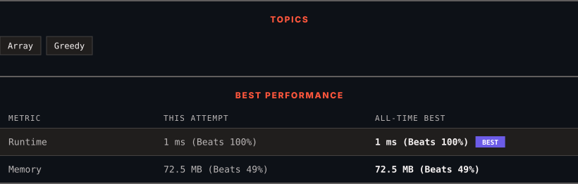

<div align="center">

# 860. Lemonade Change

      

[](https://leetcode.com/problems/lemonade-change/)

</div>

---

<div align="center">

<picture>
  <source media="(prefers-color-scheme: dark)" srcset="panel-dark.svg">
  <source media="(prefers-color-scheme: light)" srcset="panel-light.svg">
  
</picture>

</div>

> **New personal best** — Runtime improved on this submission.

### HOW IT WENT

| | |
|:--|:--|
| **Attempts** | first try |
| **Time to solve** | 4 min |
| **Verdicts** | ✅ Accepted |

---

### NOTES

_No notes yet._

---

### SOLUTIONS (1)

| # | File | Language | Date |
|:-:|------|:--------:|:----:|
| 1 | [sol1.java](./sol1.java) | `Java` | 2026-09-17 ← **latest** |

---

### PROBLEM DESCRIPTION

At a lemonade stand, each lemonade costs `$5`. Customers are standing in a queue to buy from you and order one at a time (in the order specified by bills). Each customer will only buy one lemonade and pay with either a `$5`, `$10`, or `$20` bill. You must provide the correct change to each customer so that the net transaction is that the customer pays `$5`.

Note that you do not have any change in hand at first.

Given an integer array `bills` where `bills[i]` is the bill the `i^th` customer pays, return `true` *if you can provide every customer with the correct change, or* `false` *otherwise*.

 

**Example 1:**

```

**Input:** bills = [5,5,5,10,20]
**Output:** true
**Explanation:** 
From the first 3 customers, we collect three $5 bills in order.
From the fourth customer, we collect a $10 bill and give back a $5.
From the fifth customer, we give a $10 bill and a $5 bill.
Since all customers got correct change, we output true.

```

**Example 2:**

```

**Input:** bills = [5,5,10,10,20]
**Output:** false
**Explanation:** 
From the first two customers in order, we collect two $5 bills.
For the next two customers in order, we collect a $10 bill and give back a $5 bill.
For the last customer, we can not give the change of $15 back because we only have two $10 bills.
Since not every customer received the correct change, the answer is false.

```

 

**Constraints:**

	- `1 <= bills.length <= 10^5`

	- `bills[i]` is either `5`, `10`, or `20`.

---

<div align="center">

<sub>Auto-synced by <strong>LeetSync</strong> · Built by <a href="https://deveshsamant.in/">Devesh Samant</a></sub>

</div>
